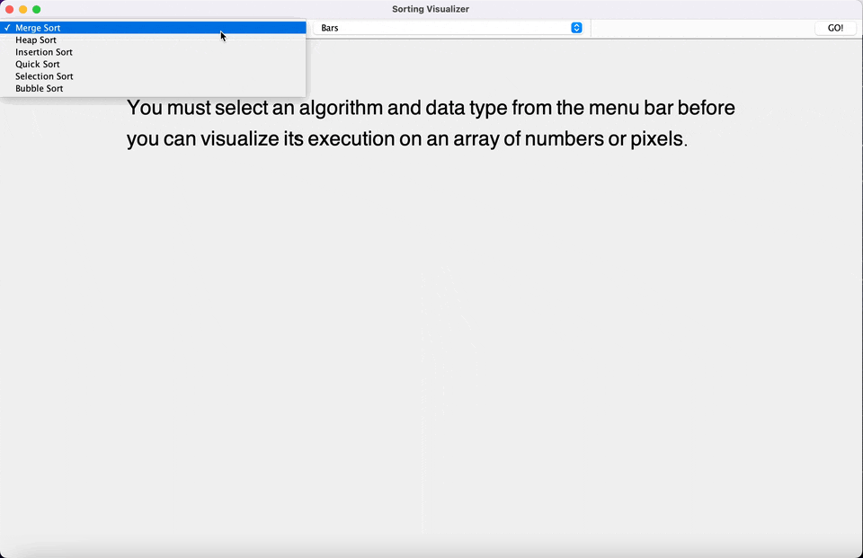

# Sorting-Visualizer

This program helps us visualize how sorting algorithms such as Merge Sort, Quick Sort, Selection Sort, Insertion Sort, Bubble Sort, and Heap sort would sort a bar-graph or pixels in image using Swing animation tool. After selecting an algorithm and data representation type, the user can run an automated animation. The program will also allow the user to slow down and pace up the sorting processing for better understanding.

## Demo
Below is an animation of a sample run to visualize Merge Sort:

